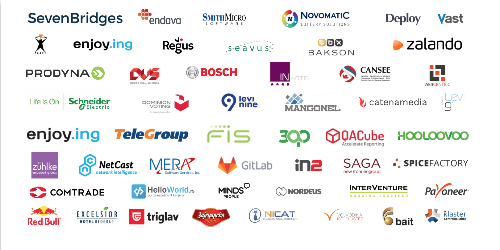

{}

# heapcon
## October 3rd—4th, 2019.
## Belgrade, Serbia

{}

{}

Heapcon is a regional tech conference for software engineers and technology enthusiasts.

Heapcon is created by a group of professionals from multidisciplinary fields, including: software engineering, project management, marketing, communications and publishing. The conference puts 14 years of IT event management into practice.

{}

{}

# About Heapcon&nbsp;2019.

+ Venue: Kombank dvorana
+ Duration: 2 days
+ Formats of knowledge exchange: talks, unconference, workshops and roundtables
+ Audience: 800+ software engineers and tech experts

{}

{}

Heapspace activities and previous conferences were supported by:

{}

{}
# Sponsorship packages

&nbsp;                     | DIAMOND (x1) | PLATINUM (x2) | GOLD (x6) | SILVER (x8) | BRONZE (x8) | VIRTUAL
---------------------------|--------------|---------------|-----------|-------------|-------------|---------
HS partners for a year     | ✅           |               |           |             |             |
Conference session         | ✅           | ✅           | ✅        |             |             |
Welcome bag insert         | ✅           | ✅           | ✅        | ✅          | ✅          |
Logo on logo wall          | ✅           | ✅            | ✅       | ✅          | ✅          |
Exhibition booth           | XL (24sqm)   | L  (12sqm)      | M  (6sqm) | M  (4sqm)     | S  (2sqm)    |
Logo on the website        | ✅           | ✅            | ✅        | ✅          | ✅         | ✅
Free tickets               | 10           | 8              | 4         | 3           | 1           | 1
Booth staff tickets        | 6            | 4              | 4         | 2           | 1           |
Ticket discount  in %   | 15           | 15             | 15        | 10          | 10          | 10
Booth                      | ✅           | ✅            | ✅        | ✅          | ✅         |
Price  (in EUR ex. VAT) | 16k          | 12k            | 7k        | 5k          | 3k          | 1.5k

{}
{}

# heapcon a la carte

### Track sponsor (x2) : €3,000
You can brand one conference track in the venue. Branding of the live stream on YouTube is included.

### Keynote sponsor : €4,000
Stage branding during the keynote talk which is streamed to all tracks of the conference and on YouTube. This provides a great visibility of your brand/company.

### Q&A session sponsors (x2) : €2,000
Your branding will be visible on microphone-cubes attendees are using to ask questions.

### Roundtable sponsor : €3,000
Roundtable room/s will be branded with your rollups, and participants will use your stationery material for notes.

### Photo booth sponsor : €3,000
Brand the frame of the booth and have photos with your branding shared on social media.

### WiFi sponsor : €3,000
You choose the password you want to set and the name of the network.

### Beverage spot sponsor : €2,000
3D fridge branding on several locations in the venue.

### Coffee corner sponsor : €3,000
All coffee cup during Heapcon will have your branding.

### Speakers’ dinner sponsor : €1,500
This is a cool way to mingle with all conference speakers.

{}
{}

# Sponsorship package details

### Logo on logo walls
Your logo is placed on official logo walls. The size and placement depend on the sponsorship category.

### Welcome bag insert
Contribute one company-branded insert of your choice to the welcome bag. They should be useful to attendees!

### Logo on conference T-shirt and welcome bag
Your logo is featured on the welcome bag and on the official conference T-shirt.

### Conference session
Your get a slot in the conference program, 25 mins duration. Your designated speaker must be an expert, his talk should be technical, not marketing or sales oriented. Sponsorship agreement has to be signed and session confirmed before July the 1st.

###  Logo on Heapcon website
Your logo appears on Heapcon website and it is displayed alternating with the logos of other partners and sponsors in the same category.

### Press release mentioning
As a diamond sponsor your company will be mentioned as the main sponsor in every press release. All other sponsorship categories are mentioned thought out the text.

###  Free tickets
The number of free tickets is distributed based on the sponsorship category.

###  Ticket discount
As a sponsor, you have a discount on tickets (10 or 15%)

{}

{}

# Support Heapcon!

### Dimitrije Stamenković


[dimitrije@heapspace.rs](mailto:dimitrije@heapspace.rs)

+381 63 448 241

### Ninoslav Rupić

[nino@heapspace.rs](mailto:nino@heapspace.rs)

+381 65 2580 415

# &nbsp;

{}